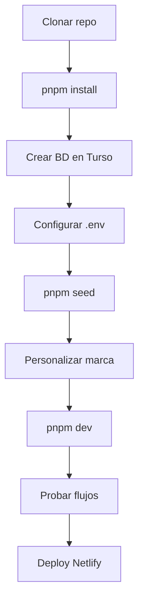

# SAVI Demo · Sistema de inventario y ventas

Demo comercial en **Astro 5** con backend SSR, base de datos **Turso (libSQL)** y despliegue en **Netlify**. Cubre inventario, ventas, créditos, reportes, cotizaciones y gestión de usuarios con roles.

---

## Requisitos previos

Instalá estas herramientas **antes** de empezar:

| Herramienta | Versión recomendada | Para qué |
|-------------|---------------------|----------|
| [Node.js](https://nodejs.org/) | 18 o superior | Runtime del proyecto |
| [pnpm](https://pnpm.io/installation) | 9+ | Gestor de paquetes |
| [Turso CLI](https://docs.turso.tech/cli) | Última | Crear BD y ejecutar SQL *(opcional si usás la consola web)* |
| Cuenta [Turso](https://turso.tech/) | — | Base de datos en la nube |
| Cuenta [Netlify](https://www.netlify.com/) | — | Despliegue en producción |

```bash
# Verificar instalación
node -v
pnpm -v
turso --version   # opcional
```

---

## Dependencias del proyecto

Se instalan automáticamente con `pnpm install`. Referencia principal:

| Paquete | Uso |
|---------|-----|
| `astro` | Framework y SSR |
| `@astrojs/netlify` | Adapter para producción (Netlify) |
| `@astrojs/node` | Adapter para desarrollo local en Windows |
| `@libsql/client` | Conexión a Turso |
| `bcrypt` | Hash de contraseñas |
| `jsonwebtoken` | Autenticación por JWT |
| `chart.js` | Gráficos del dashboard |
| `xlsx` | Carga masiva de productos (Excel) |
| `html-to-image` | Exportar / imprimir documentos |
| `dotenv` | Variables de entorno (seed local) |

---

## Guía: cliente nuevo (de cero a demo)

Cada cliente debe tener **su propia base de datos Turso** y **su propio `.env`**. No compartas credenciales entre clientes.


```mermaid
flowchart TD
    A[Clonar repo] --> B[pnpm install]
    B --> C[Crear BD en Turso]
    C --> D[Configurar .env]
    D --> E[pnpm seed]
    E --> F[Personalizar marca]
    F --> G[pnpm dev]
    G --> H[Probar flujos]
    H --> I[Deploy Netlify]
```

### Paso 1 · Clonar e instalar

```bash
git clone <url-del-repo>
cd sistema-demo-inventario
pnpm install
```

### Paso 2 · Crear la base de datos en Turso

```bash
# Crear base de datos (nombre único por cliente)
turso db create cliente-xyz-demo

# Obtener URL y token
turso db show cliente-xyz-demo --url
turso db tokens create cliente-xyz-demo
```

También podés crear la BD desde el [dashboard de Turso](https://turso.tech/app).

### Paso 3 · Esquema

`pnpm seed` aplica `src/lib/db.sql` (tablas e índices). No hace falta pegar el SQL a mano en una BD nueva.

Si preferís revisar o crear las tablas por separado:

```bash
turso db shell cliente-xyz-demo < src/lib/db.sql
```

### Paso 4 · Configurar variables de entorno

Copiá `.env.example` a `.env` en la raíz (está en `.gitignore`, **no se sube al repo**):

```env
DATABASE_URL=libsql://tu-base.turso.io
DATABASE_AUTH_TOKEN=tu_token_de_turso
JWT_SECRET=secreto_largo_y_unico_por_cliente

# Datos iniciales para pnpm seed
SEED_ADMIN_USER=admin
SEED_ADMIN_PASSWORD=cambiar_por_clave_segura
SEED_ADMIN_NOMBRE=Administrador
SEED_TASA=4000
SEED_TASA_BS=36.50
SEED_CLIENTE_NOMBRE=Consumidor final
SEED_CLIENTE_CEDULA=V-00000000
SEED_CLIENTE_TELEFONO=0000-0000000
```

| Variable | Obligatoria | Descripción |
|----------|-------------|-------------|
| `DATABASE_URL` | Sí | URL de la BD Turso |
| `DATABASE_AUTH_TOKEN` | Sí | Token de acceso a Turso |
| `JWT_SECRET` | Sí | Secreto para firmar sesiones |
| `SEED_ADMIN_USER` | No | Usuario admin inicial (default: `admin`) |
| `SEED_ADMIN_PASSWORD` | No | Contraseña del admin inicial |
| `SEED_ADMIN_NOMBRE` | No | Nombre visible del admin |
| `SEED_TASA` | No | Tasa USD → COP inicial |
| `SEED_TASA_BS` | No | Tasa USD → Bs inicial (default: `36.5`) |
| `SEED_CLIENTE_NOMBRE` | No | Cliente de mostrador (default: `Consumidor final`) |
| `SEED_CLIENTE_CEDULA` | No | Cédula/RIF del cliente de mostrador |
| `SEED_CLIENTE_TELEFONO` | No | Teléfono del cliente de mostrador |

### Paso 5 · Semilla inicial

Inserta el **esquema**, el **primer administrador**, las **tasas del día** y un **cliente de mostrador**:

```bash
pnpm seed
```

Salida esperada:

```text
Admin "admin" creado.
Cliente "Consumidor final" creado.
Tasa COP: 4000
Tasa Bs: 36.5
Seed completado.
```

El script es **idempotente**: si el usuario ya existe, no lo duplica.

Si la BD ya existía antes de las tasas en Bs:

```bash
pnpm migrate:tasas
```

### Paso 6 · Personalizar la marca del cliente

| Archivo | Qué editar |
|---------|------------|
| `src/data/empresa.json` | Nombre, RIF, teléfono, dirección, email, `subtitulo`, `etiquetaMarca` y `monedaBase` (`USD` o `COP`) |
| `src/utils/tema.ts` | Colores `primario`, `secundario`, `acento` |
| `public/logo.svg` | Logo en login e impresiones |
| `public/favicon.svg` | Icono del navegador *(opcional)* |

La conversión de precios vive en `src/utils/helpers/tasas.js`:

- Precios en **USD**: COP = USD × tasa COP · Bs = USD × tasa Bs
- Precios en **COP**: USD = COP ÷ tasa COP · Bs = (COP ÷ tasa COP) × tasa Bs
- Redondeo: Bs a 2 decimales, USD a cifra cerrada o `,5`, COP a la centena inmediata superior (19220 → 19300)

### Paso 7 · Desarrollo local

```bash
pnpm dev
```

Abrí [http://localhost:4321](http://localhost:4321), iniciá sesión con el admin del seed y verificá:

- [ ] Login y cierre de sesión
- [ ] Tasa del día
- [ ] Alta de producto y cliente
- [ ] Registro de venta (contado y crédito)
- [ ] Reportes (como admin)

### Paso 8 · Datos de demo *(recomendado)*

Entrá como admin y prepará el escenario:

1. Ajustá la **tasa real** en *Tasa del Día*
2. Cargá productos (manual o **carga masiva** `.xlsx` en *Productos*)
3. Creá 1–2 clientes de prueba
4. Registrá una venta de ejemplo

### Paso 9 · Despliegue en Netlify

1. Conectá el repositorio en Netlify (`netlify.toml` ya define `pnpm build` y `dist`)
2. Agregá las variables de entorno en el panel:

   - `DATABASE_URL`
   - `DATABASE_AUTH_TOKEN`
   - `JWT_SECRET`

   > No hace falta `SEED_*` en Netlify si ya ejecutaste `pnpm seed` contra esa BD.

3. Desplegá y probá login en la URL de producción

En Windows el proyecto usa el adapter **Node** en local; en Netlify usa **Netlify** automáticamente (`astro.config.mjs`).

`electron` y `electron-builder` están en el proyecto para una licencia local futura. El wrapper del `.exe` todavía no está armado.

---

## Comandos disponibles

| Comando | Descripción |
|---------|-------------|
| `pnpm install` | Instala dependencias |
| `pnpm dev` | Servidor de desarrollo en `localhost:4321` |
| `pnpm dev:force` | Dev forzando recompilación |
| `pnpm build` | Build de producción en `./dist/` |
| `pnpm preview` | Preview del build local |
| `pnpm seed` | Aplica el esquema e inserta admin, tasas y cliente de mostrador |
| `pnpm migrate:movimientos` | Crea la tabla de historial de stock en BD existentes |
| `pnpm astro ...` | CLI de Astro |

---

## Módulos del sistema

| Módulo | Ruta | Rol |
|--------|------|-----|
| Dashboard | `/` | Todos |
| Tasa del día | `/tasa` | Todos |
| Clientes | `/clientes` | Todos |
| Ventas | `/ventas` | Todos |
| Créditos | `/creditos` | Todos |
| Cotizaciones | `/cotizaciones` | Todos |
| Agregar cotización | `/cotizaciones/agregar` | Todos |
| Detalle cotización | `/cotizaciones/[id]` | Todos |
| Productos | `/productos` | Admin |
| Historial de stock | `/productos/historial` | Admin |
| Cargas de factura | `/cargas` | Admin |
| Reportes | `/reportes` | Admin |
| Bitácora | `/bitacora` | Admin |
| Usuarios | `/usuarios` | Admin |

---

## Estructura del proyecto

```text
/
├── public/              # Assets estáticos (logo, favicon)
├── scripts/
│   └── seed.ts          # Semilla: esquema, admin, tasas y cliente mostrador
├── src/
│   ├── components/      # Navbar, encabezados de empresa
│   ├── data/
│   │   └── empresa.json # Datos de marca del cliente
│   ├── layouts/
│   ├── lib/
│   │   └── db.sql       # Esquema completo de la BD
│   ├── pages/           # Vistas Astro + API routes
│   └── utils/           # Auth, tema, transacciones, validaciones
├── astro.config.mjs
├── netlify.toml
├── package.json
├── .env.example
└── .env                 # Local, no commitear
```

---

## Resumen por cliente

| Elemento | ¿Único por cliente? |
|----------|---------------------|
| Código del repo | Compartido |
| BD Turso | **Sí — una por cliente** |
| `.env` / vars Netlify | **Sí** |
| `pnpm seed` | **Sí — una vez por BD** |
| `empresa.json` + `tema.ts` + logos | **Sí** |
| Productos / clientes demo | **Sí — opcional** |

---

## Solución de problemas

**`pnpm seed` → Falta DATABASE_URL**  
Creá el `.env` en la raíz con las credenciales de Turso.

**Error al hacer seed / login**  
Verificá `DATABASE_URL` y `DATABASE_AUTH_TOKEN`. El seed ahora aplica `db.sql` solo.

**Login falla después del seed**  
La contraseña debe coincidir con `SEED_ADMIN_PASSWORD` del `.env` usado al correr el seed.

**Build falla en Netlify**  
Confirmá que `DATABASE_URL`, `DATABASE_AUTH_TOKEN` y `JWT_SECRET` estén en las variables de entorno del sitio.

---

## Licencia y uso

Proyecto demo comercial · SAVI. Uso interno y presentación a clientes.
